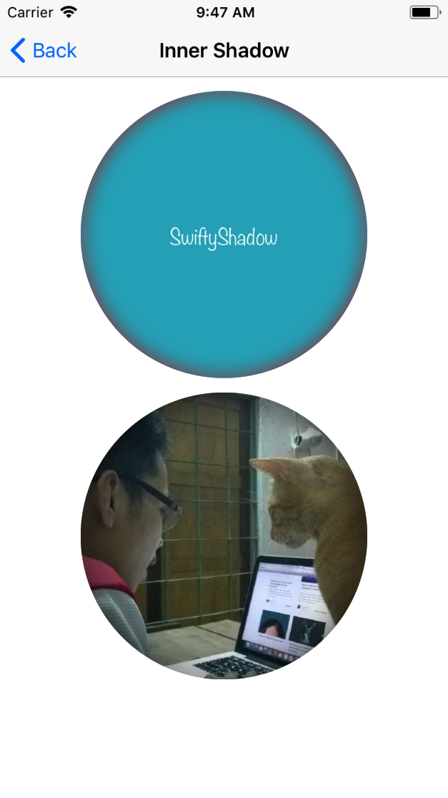
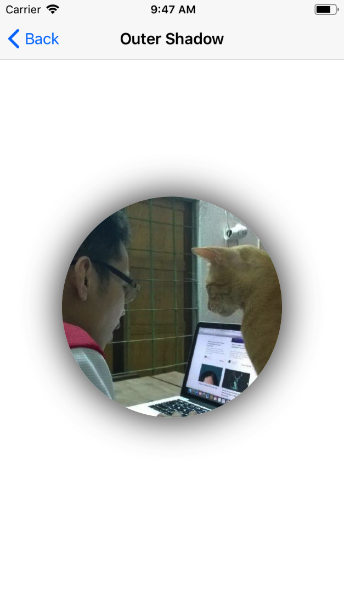
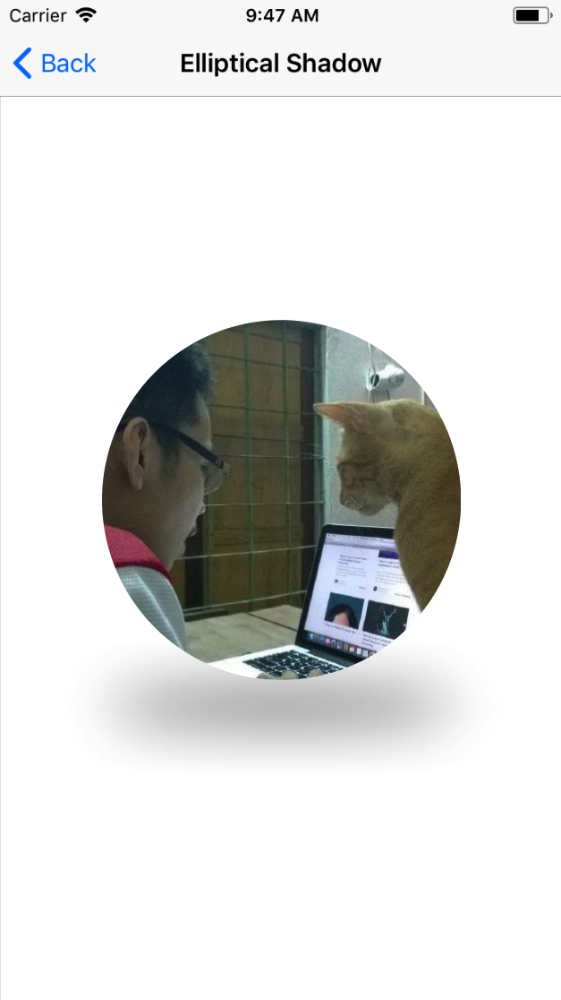
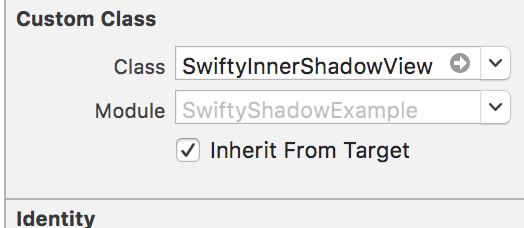

# SwiftyShadow

[](https://www.codacy.com/app/noblakit01/SwiftyShadow?utm_source=github.com&utm_medium=referral&utm_content=noblakit01/SwiftyShadow&utm_campaign=badger)

Helper Libraries to generate wonderful shadow in Swift iOS.

## Screenshots

<table>
  <tr>
    <th>
      
    </th>
    <th>
      
    </th>
    <th>
      
    </th>
  </tr>
</table>

## Requirements

* iOS 8.0+
* Xcode 8+
* Swift 4.2

## Installation

### CocoaPods

To integrate PhotoCollectionView into your Xcode project using CocoaPods, specify it in your `Podfile`:

```ruby
source 'https://github.com/CocoaPods/Specs.git'
platform :ios, '8.0'
use_frameworks!

pod 'SwiftyShadow', '~> 1.7.0'
```

Then, run the following command:

```bash
$ pod install
```

### Manually
- Drag and drop `Sources` folder into your project.

## Usage

### Inner Shadow in View
Use `SwiftyInnerShadowView` class as UIView to make this View has inner shadow.

- Use Storyboard

Set SwiftyInnerShadowView as UIView Class in the storyboard:
<table>
  <tr>
    <th>
      
    </th>
  </tr>
</table>

then make an outlet
```
@IBOutlet weak var testView: SwiftyInnerShadowView!
```


- inner shadow properties
Set inner shadow propeties through `shadowLayer` of `SwiftyInnerShadowView`
```
testView.shadowLayer.shadowRadius = 4
testView.shadowLayer.shadowColor = UIColor.red.cgColor
testView.shadowLayer.shadowOpacity = 0.8
testView.shadowLayer.shadowOffset = CGSize.zero
testView.cornerRadius = 120
```

### Outer Shadow in View
You can set up outer shadow in view with default properties in UIView
```
imageView.layer.cornerRadius = 120
imageView.layer.shadowRadius = 20
imageView.layer.shadowOpacity = 0.8
imageView.layer.shadowColor = UIColor.black.cgColor
imageView.layer.shadowOffset = CGSize.zero
```

but shadow doesn't work if view has `clipsToBounds = true`, so just call `generateOuterShadow` function
```
imageView.generateOuterShadow()
```

### Elliptical Shadow
You need set up shadow properties first, then call `generateEllipticalShadow`
```
imageView.layer.shadowRadius = 20
imageView.layer.shadowOpacity = 0.8
imageView.layer.shadowColor = UIColor.black.cgColor
imageView.layer.shadowOffset = CGSize.zero
        
imageView.generateEllipticalShadow()
```

## TODO
[Todo](https://github.com/noblakit01/SwiftyShadow/blob/master/TODO.md)
## License
[MIT](http://thi.mit-license.org/)
