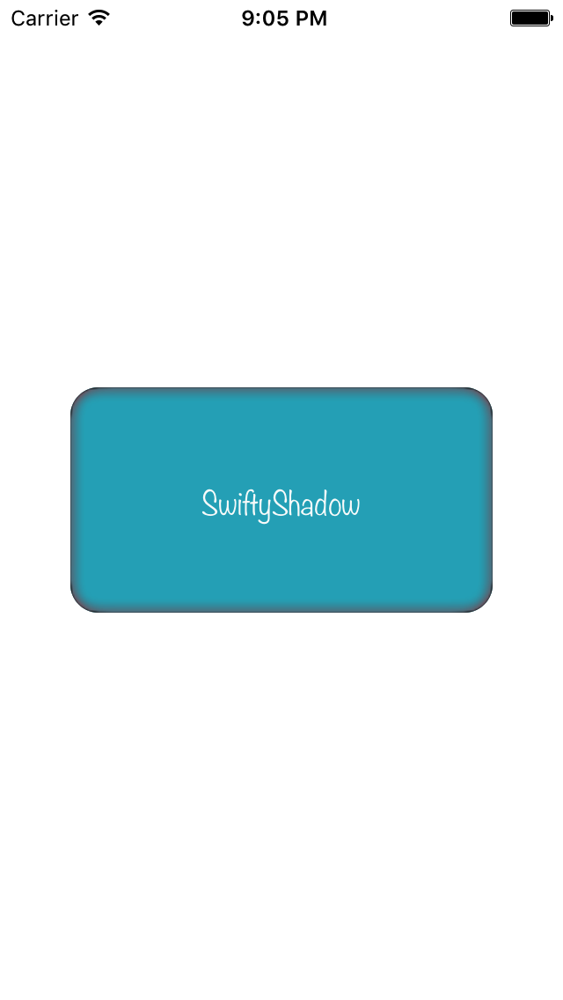

# SwiftyShadow
Helper Libraries to generate wonderful shadow in Swift iOS.

## Screenshots

<table>
  <tr>
    <th>
      
    </th>
  </tr>
</table>

## Requirements

* iOS 8.0+
* Xcode 8+
* Swift 3

## Installation

### CocoaPods

To integrate PhotoCollectionView into your Xcode project using CocoaPods, specify it in your `Podfile`:

```ruby
source 'https://github.com/CocoaPods/Specs.git'
platform :ios, '8.0'
use_frameworks!

pod 'SwiftyShadow'
```

Then, run the following command:

```bash
$ pod install
```

### Manually
- Drag and drop `SwiftyShadow` folder into your project.

## Usage

## License
[MIT](http://thi.mit-license.org/)
